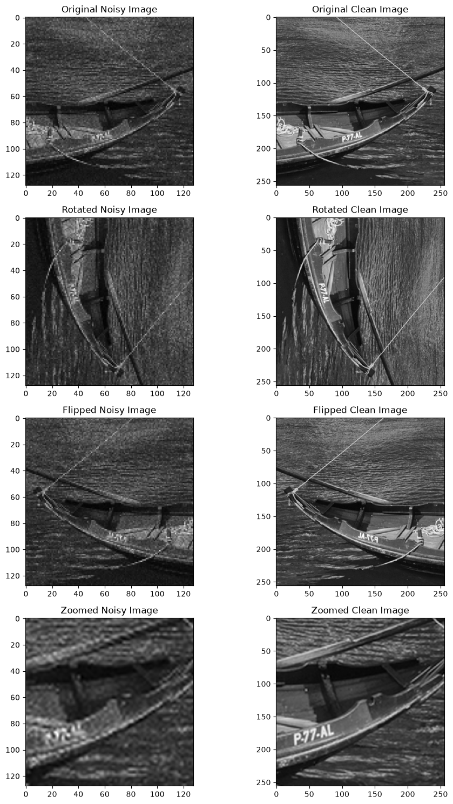
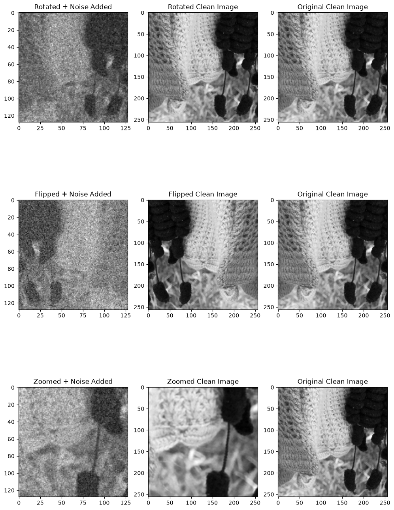
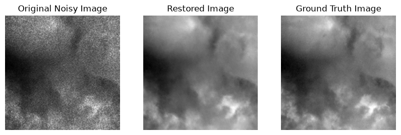
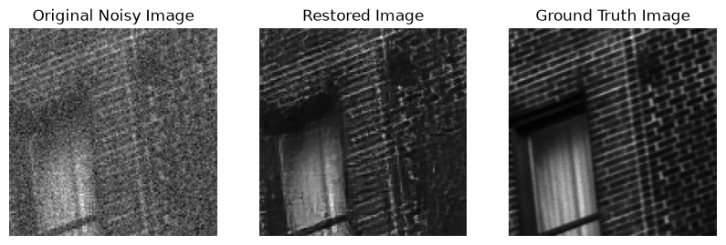
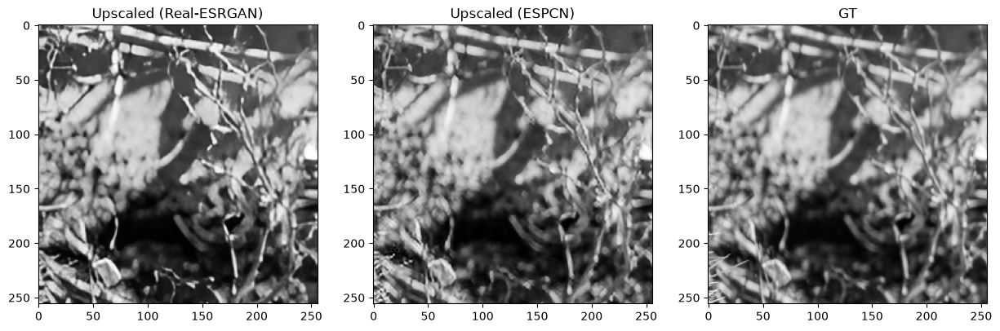
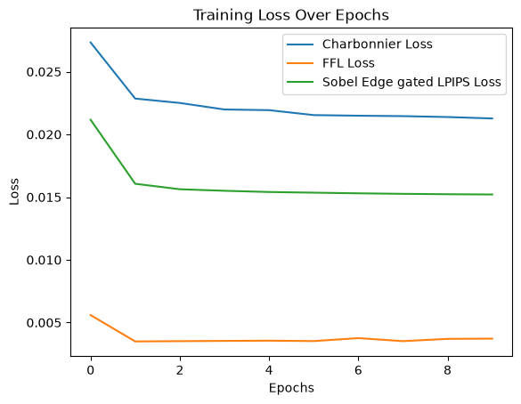
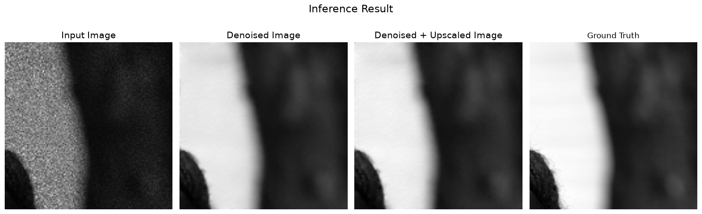

# Setup

1. Clone the repository

```Shell
git clone https://github.com/eklipse18/kla_hackathon
```

2. Install dependencies (use python 3.12.10)

```Shell
uv sync
```

or (with a virtual environment)

```Shell
pip install -r requirements.txt
```

3. Download the dataset
   Download the [dataset](https://drive.google.com/drive/folders/1VKiFW-kDk9-q5XRPu3nrl08OM94EwzV6?usp=drive_link) into a folder called `data/`

# Project structure

```
|--  data/
    |-- Test_NoisyLR/
    	|-- output/
    |-- train/
|-- inference/
|-- models/
|-- scripts/
	|-- upscaler_models/
|-- requirements.txt, ...
|-- standalone.py
|-- run.py
|-- README.md
```

# Usage

Perform batch inference with `run.py`:

```Shell
python run.py <input_dir> <output_dir> --batch-size n
```

(`<output_dir>` is optional, if not provided, defaults to `<input_dir>/output`. `--batch-size` is also an optional flag, if not provided, defaults to a batch size of 2. Increase if training on a GPU with higher VRAM, decrease if facing CUDA OOM errors.)

Perform single file analysis with `standalone.py`:

```Shell
python standalone.py run <file_path> <save_path?>
```

Show side by side comparision of input and output pictures, and save output picture if `save_path` is specified.

You can also do `batch` inference with `standalone.py`:

```Shell
python standalone.py batch <input_dir> <output_dir> --batch-size n
```

# Overall Architecture

We decided on a two-model approach: **Restormer** for denoising and **ESPCN** for upscaling.

# Data augmentation

We went with taking the ground truth images (GT) and performing operations such as rotation, flipping and cropping on them (with bicubic scaling). We then apply the same operations in the same random order on the Noisy image to get a new `(noisy, gt)` pair. We generated ~9200 such pairs, giving us a total dataset size of about 12,000. This is handled in `scripts/data_augmentaion.ipynb`.





# Training (Denoiser)

We started off by first training Restormer from scratch. It has a fairly simple architecture, and the small model architecture will help keep our inference times low:

```Python
class MDTA(nn.Module):
    def __init__(self, channels, num_heads):
        super(MDTA, self).__init__()
        self.num_heads = num_heads
        self.temperature = nn.Parameter(torch.ones(1, num_heads, 1, 1))

        self.qkv = nn.Conv2d(channels, channels * 3, kernel_size=1, bias=False)
        self.qkv_conv = nn.Conv2d(channels * 3, channels * 3, kernel_size=3, padding=1, groups=channels * 3, bias=False)
        self.project_out = nn.Conv2d(channels, channels, kernel_size=1, bias=False)

    def forward(self, x):
        b, c, h, w = x.shape
        q, k, v = self.qkv_conv(self.qkv(x)).chunk(3, dim=1)

        q = q.reshape(b, self.num_heads, -1, h * w)
        k = k.reshape(b, self.num_heads, -1, h * w)
        v = v.reshape(b, self.num_heads, -1, h * w)
        q, k = F.normalize(q, dim=-1), F.normalize(k, dim=-1)

        attn = torch.softmax(torch.matmul(q, k.transpose(-2, -1).contiguous()) * self.temperature, dim=-1)
        out = self.project_out(torch.matmul(attn, v).reshape(b, -1, h, w))
        return out


class GDFN(nn.Module):
    def __init__(self, channels, expansion_factor):
        super(GDFN, self).__init__()

        hidden_channels = int(channels * expansion_factor)
        self.project_in = nn.Conv2d(channels, hidden_channels * 2, kernel_size=1, bias=False)
        self.conv = nn.Conv2d(hidden_channels * 2, hidden_channels * 2, kernel_size=3, padding=1,
                              groups=hidden_channels * 2, bias=False)
        self.project_out = nn.Conv2d(hidden_channels, channels, kernel_size=1, bias=False)

    def forward(self, x):
        x1, x2 = self.conv(self.project_in(x)).chunk(2, dim=1)
        x = self.project_out(F.gelu(x1) * x2)
        return x


class TransformerBlock(nn.Module):
    def __init__(self, channels, num_heads, expansion_factor):
        super(TransformerBlock, self).__init__()

        self.norm1 = nn.LayerNorm(channels)
        self.attn = MDTA(channels, num_heads)
        self.norm2 = nn.LayerNorm(channels)
        self.ffn = GDFN(channels, expansion_factor)

    def forward(self, x):
        b, c, h, w = x.shape
        x = x + self.attn(self.norm1(x.reshape(b, c, -1).transpose(-2, -1).contiguous()).transpose(-2, -1)
                          .contiguous().reshape(b, c, h, w))
        x = x + self.ffn(self.norm2(x.reshape(b, c, -1).transpose(-2, -1).contiguous()).transpose(-2, -1)
                         .contiguous().reshape(b, c, h, w))
        return x


class DownSample(nn.Module):
    def __init__(self, channels):
        super(DownSample, self).__init__()
        self.body = nn.Sequential(nn.Conv2d(channels, channels // 2, kernel_size=3, padding=1, bias=False),
                                  nn.PixelUnshuffle(2))

    def forward(self, x):
        return self.body(x)


class UpSample(nn.Module):
    def __init__(self, channels):
        super(UpSample, self).__init__()
        self.body = nn.Sequential(nn.Conv2d(channels, channels * 2, kernel_size=3, padding=1, bias=False),
                                  nn.PixelShuffle(2))

    def forward(self, x):
        return self.body(x)


class Restormer(nn.Module):
    def __init__(self, num_blocks=[4, 6, 6, 8], num_heads=[1, 2, 4, 8], channels=[48, 96, 192, 384], num_refinement=4,
                 expansion_factor=2.66):
        super(Restormer, self).__init__()

        self.embed_conv = nn.Conv2d(1, channels[0], kernel_size=3, padding=1, bias=False)

        self.encoders = nn.ModuleList([nn.Sequential(*[TransformerBlock(
            num_ch, num_ah, expansion_factor) for _ in range(num_tb)]) for num_tb, num_ah, num_ch in
                                       zip(num_blocks, num_heads, channels)])
        # the number of down sample or up sample == the number of encoder - 1
        self.downs = nn.ModuleList([DownSample(num_ch) for num_ch in channels[:-1]])
        self.ups = nn.ModuleList([UpSample(num_ch) for num_ch in list(reversed(channels))[:-1]])
        # the number of reduce block == the number of decoder - 1
        self.reduces = nn.ModuleList([nn.Conv2d(channels[i], channels[i - 1], kernel_size=1, bias=False)
                                      for i in reversed(range(2, len(channels)))])
        # the number of decoder == the number of encoder - 1
        self.decoders = nn.ModuleList([nn.Sequential(*[TransformerBlock(channels[2], num_heads[2], expansion_factor)
                                                       for _ in range(num_blocks[2])])])
        self.decoders.append(nn.Sequential(*[TransformerBlock(channels[1], num_heads[1], expansion_factor)
                                             for _ in range(num_blocks[1])]))
        # the channel of last one is not change
        self.decoders.append(nn.Sequential(*[TransformerBlock(channels[1], num_heads[0], expansion_factor)
                                             for _ in range(num_blocks[0])]))

        self.refinement = nn.Sequential(*[TransformerBlock(channels[1], num_heads[0], expansion_factor)
                                          for _ in range(num_refinement)])
        self.output = nn.Conv2d(channels[1], 1, kernel_size=3, padding=1, bias=False)

    def forward(self, x):
        fo = self.embed_conv(x)
        out_enc1 = self.encoders[0](fo)
        out_enc2 = self.encoders[1](self.downs[0](out_enc1))
        out_enc3 = self.encoders[2](self.downs[1](out_enc2))
        out_enc4 = self.encoders[3](self.downs[2](out_enc3))

        out_dec3 = self.decoders[0](self.reduces[0](torch.cat([self.ups[0](out_enc4), out_enc3], dim=1)))
        out_dec2 = self.decoders[1](self.reduces[1](torch.cat([self.ups[1](out_dec3), out_enc2], dim=1)))
        fd = self.decoders[2](torch.cat([self.ups[2](out_dec2), out_enc1], dim=1))
        fr = self.refinement(fd)
        out = self.output(fr) + x
        return out
```

This was trainiend with `LPIPS + Charbonnier` Loss.

This gave us results like the following:





> LPIPS score between restored and ground truth: 0.1397971659898758
> SSIM: 2.4497509002685547e-05
> PSNR:  30.86580753326416
> Time taken for restoration: 0.02075672149658203 seconds

These ~12000 images were then saved as input data for training the upscaler, into `data/train/restormer_out`

# Training (Upscaler)

For the upscaler, we eventually decided to go with `ESPCN` due to its extremely small architecture giving us insanely fast inference times with a decently scoring output. You can see our comparision attempts in `comapre_upscalers.ipynb`

Originally, when trained we got images with heavy checkerboard patterning, so we added an `AntiAliasBlock` to help counterract that.

```Python
class AntiAliasBlock(nn.Module): 
    def __init__(self, channels: int, kernel_size: int = 5, identity_weight: float = 0.9):
        super().__init__()
        assert kernel_size % 2 == 1, "kernel_size must be odd"
        self.kernel_size = kernel_size
        self.channels = channels
 
        self.conv = nn.Conv2d(
            channels, channels, kernel_size,
            padding=kernel_size // 2, groups=channels, bias=False
        )
 
        # Near-identity kernel: mostly a delta at the center, blended
        # with a small amount of uniform averaging.
        with torch.no_grad():
            k = kernel_size
            center = k // 2
            identity_kernel = torch.zeros(k, k)
            identity_kernel[center, center] = 1.0
 
            avg_kernel = torch.ones(k, k) / (k * k)
 
            blended = identity_weight * identity_kernel + (1 - identity_weight) * avg_kernel
            blended = blended / blended.sum()  # preserve DC gain = 1.0
 
            weight = blended.view(1, 1, k, k).repeat(channels, 1, 1, 1)
            self.conv.weight.copy_(weight)
 
    def forward(self, x):
        return self.conv(x)
 
 
class ESPCN(nn.Module):
    def __init__(self, scale_factor, num_channels=1,
                 aa_kernel_size: int = 5, aa_identity_weight: float = 0.9):
        super(ESPCN, self).__init__()
 
        # Feature extraction
        self.conv1 = nn.Conv2d(num_channels, 64, kernel_size=5, padding=2)
        self.tanh1 = nn.Tanh()
 
        # Non-linear mapping
        self.conv2 = nn.Conv2d(64, 32, kernel_size=3, padding=1)
        self.tanh2 = nn.Tanh()
 
        # Sub-pixel convolution layer
        self.conv3 = nn.Conv2d(32, num_channels * (scale_factor ** 2), kernel_size=3, padding=1)
        self.pixel_shuffle = nn.PixelShuffle(scale_factor)
 
        # Anti-aliasing block, applied after the sub-pixel shuffle
        self.anti_alias = AntiAliasBlock(
            channels=num_channels,
            kernel_size=aa_kernel_size,
            identity_weight=aa_identity_weight,
        )
 
    def forward(self, x):
        x = self.tanh1(self.conv1(x))
        x = self.tanh2(self.conv2(x))
        x = self.pixel_shuffle(self.conv3(x))
        x = self.anti_alias(x)
        return x
```

This model was trained using the following custom loss function (Charbonnier + Focal Frequency Loss + Sobel Edge gated LPIPS):

```Python
from focal_frequency_loss import FocalFrequencyLoss

class SobelEdgeGate(nn.Module):
    def __init__(self):
        super().__init__()
        # Sobel kernels for X and Y gradients
        sobel_x = torch.tensor([[-1, 0, 1], [-2, 0, 2], [-1, 0, 1]], dtype=torch.float32)
        sobel_y = torch.tensor([[-1, -2, -1], [0, 0, 0], [1, 2, 1]], dtype=torch.float32)
  
        # Register as non-trainable buffers
        self.register_buffer('weight_x', sobel_x.view(1, 1, 3, 3))
        self.register_buffer('weight_y', sobel_y.view(1, 1, 3, 3))

    def forward(self, x):
        # Convert RGB to Grayscale for edge extraction if needed
        if x.size(1) == 3:
            gray = 0.2989 * x[:, 0:1] + 0.5870 * x[:, 1:2] + 0.1140 * x[:, 2:3]
        else:
            gray = x

        edge_x = F.conv2d(gray, self.weight_x, padding=1)
        edge_y = F.conv2d(gray, self.weight_y, padding=1)

        # Magnitude of gradients
        magnitude = torch.sqrt(edge_x**2 + edge_y**2 + 1e-6)

        # Normalize between 0 and 1 per image/batch
        mag_max = magnitude.amax(dim=(2, 3), keepdim=True)
        gate = magnitude / (mag_max + 1e-6)
        return gate

class SobelGatedLPIPS(nn.Module):
    def __init__(self, net='vgg'):
        super().__init__()
        self.lpips = LPIPS(net=net, eval_mode=True, spatial = True)
        self.edge_gate = SobelEdgeGate()

    def forward(self, pred, target):
        # Standard LPIPS computes feature-space distance
        base_lpips_map = self.lpips(pred, target, normalize=True)
  
        # Compute edge mask based on target image structure
        gate = self.edge_gate(target)
  
        # Resize gate if necessary to match feature maps, or apply directly 
        # as a spatial weighting on the input space or final reduction
        gated_loss = (base_lpips_map * gate).mean()
        return gated_loss

class CustomLoss(nn.Module):
    def __init__(self, epsilon=1e-6):
        """Charbonnier + Focal Freq + Sobel edge gated LPIPS"""
        super(CustomLoss, self).__init__()
        self.epsilon = epsilon
        self.ffl = FocalFrequencyLoss(loss_weight=1.0, alpha=1.0).to(DEVICE)
        self.sobel_lpips = SobelGatedLPIPS().to(DEVICE)

    def forward(self, prediction, target):
        diff = prediction - target
        ch_loss = torch.mean(torch.sqrt(diff * diff + self.epsilon * self.epsilon)).to(DEVICE)
        ffl_loss = self.ffl(prediction, target)
        sobel_lpips_loss = self.sobel_lpips(prediction, target)
        return ch_loss, 10 * ffl_loss, sobel_lpips_loss
```

We chose this because just using `Charbonnier + LPIPS/SSIM` was giving us boxy edges that were not smoothed out. To overcome this, we decided to add the `Sobel Edge gated LPIPS` loss to make the model incur higher loss if the image is less similar near sobel detected edges. We then followed this by adding the `Focal Frequency Loss` to help the model better learn textures and surface data. We experimented with different weights and decided on using a `1:10:1::Charbonnier:FFL:SEGLPIPS` ratio.

### Losses:



### Final inference



> Total time taken: 0.01964426040649414 seconds
> PSNR:  35.89777600620434
> SSIM:  0.956510977587223
> LPIPS: 0.13843943998466

### Putting it all together

Finally, we combined these two models after saving their weights in the `models` directory in the `standalone.py` and `run.py` files. The model creation and loading is handled in the `inference` submodule.
